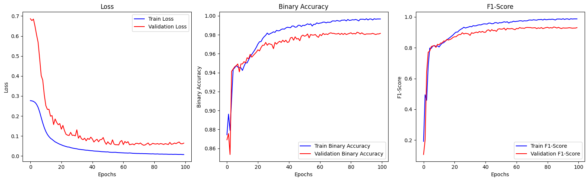
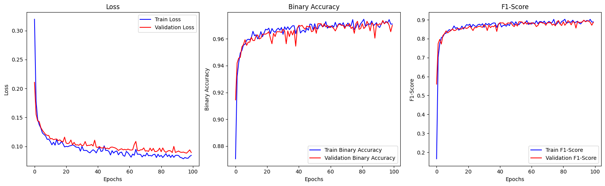
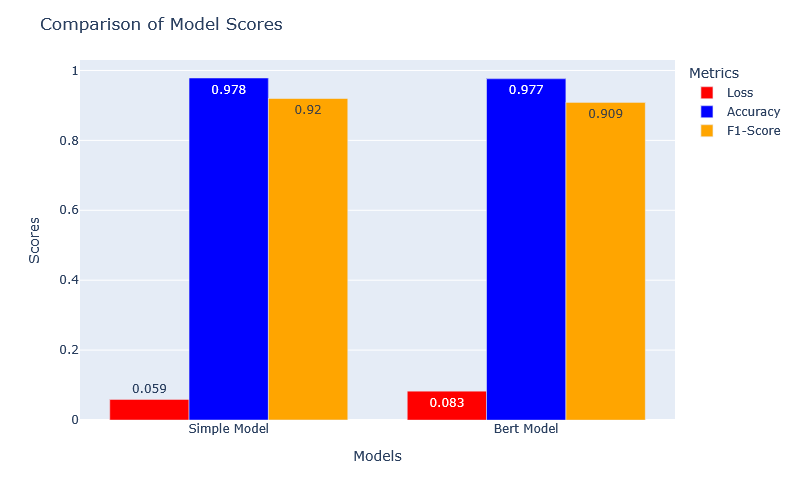

# AT&T Spam Detector (Deep Learning)

[](http://forthebadge.com) [](https://forthebadge.com)


This is a deep learning project, with text. The goal is to say if the SMS message is a spam or not, using tensorflow to build a deep learning model.

## Getting Started

All the components of each step are in this [Notebook](AT&T_Project_YP.ipynb).
* Preprocessing
* Baseline model
* Bert model
* Performance comparison

All of that with graphical interprestation & evaluation 📈.

### Prerequisites

Things you need to run the codes:

```
python 3.11.5

pandas 
numpy
scikit-learn
matplotlib
tensorflow
tensorflow-text=="2.15.0"
```

## Some Results

Here are some graphical results:

* For the basic model:



* For the Bert model:



* Performance comparison:



The 2 models have quiet similar performances and scores, but the `Bert model` is much more time longer to compute than the `simple model`. Moreover, for more general data with much more number of message, the `Bert model` could be more stable than the `simple model`. So for real utilization, it will depend of the case and needing, if we need something fast or more stable.

## Acknowledgments

* Thanks for Jedha and its instructors for the lectures, exercises and all the work.


